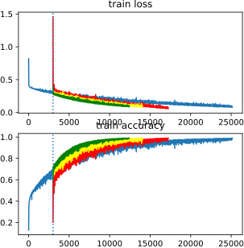
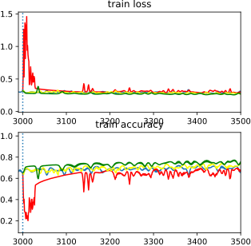
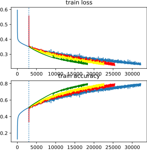
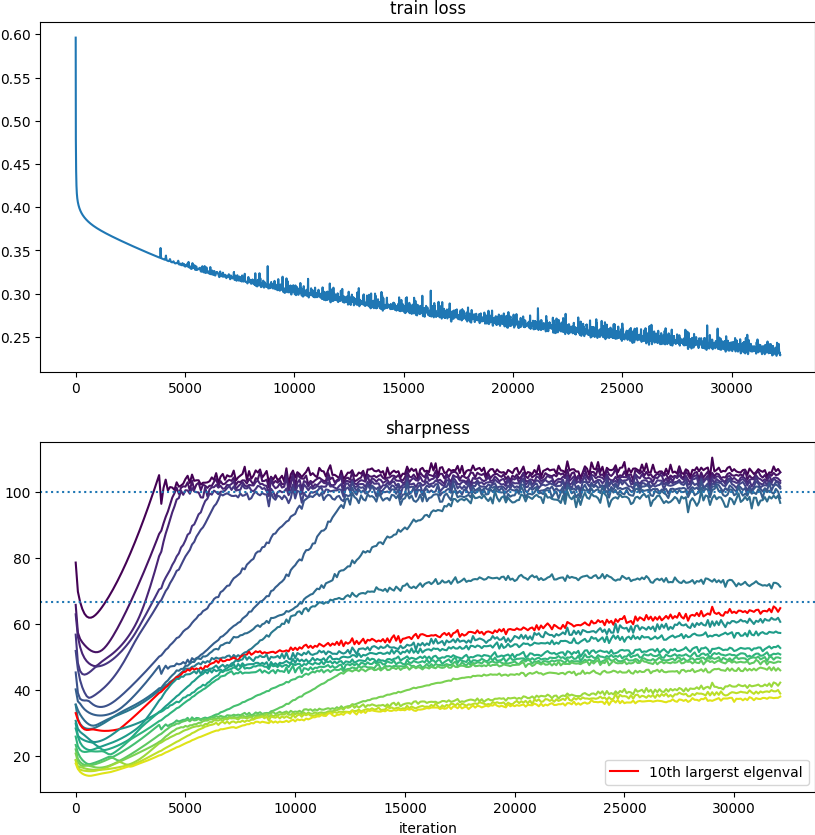
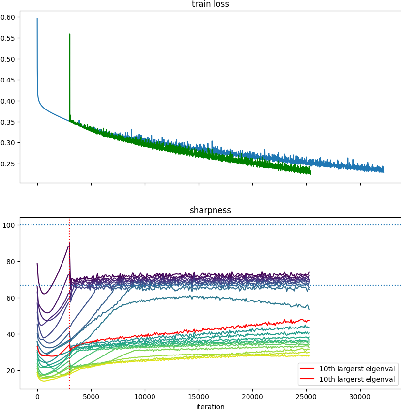
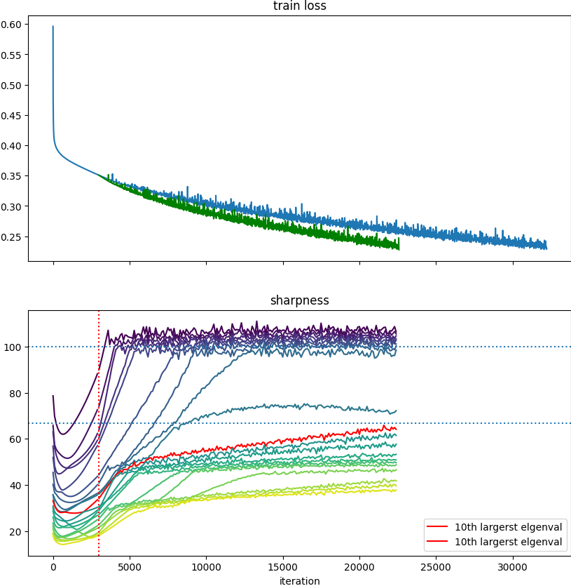
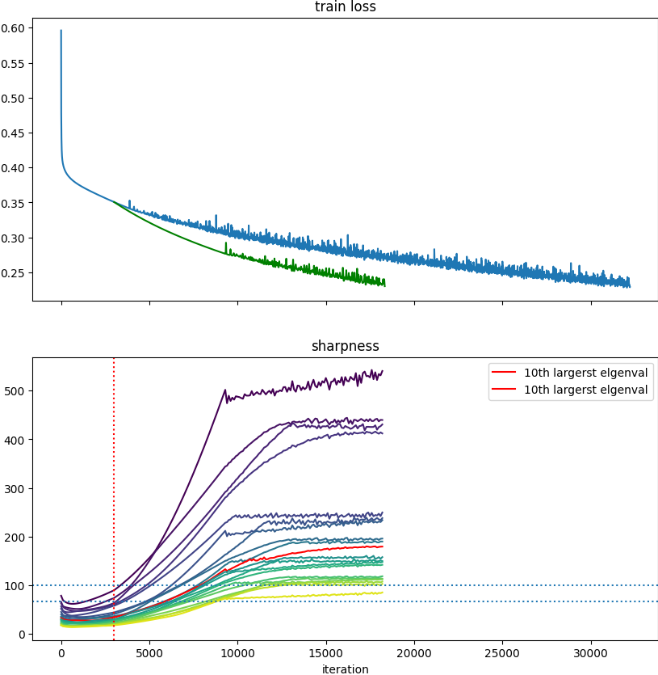
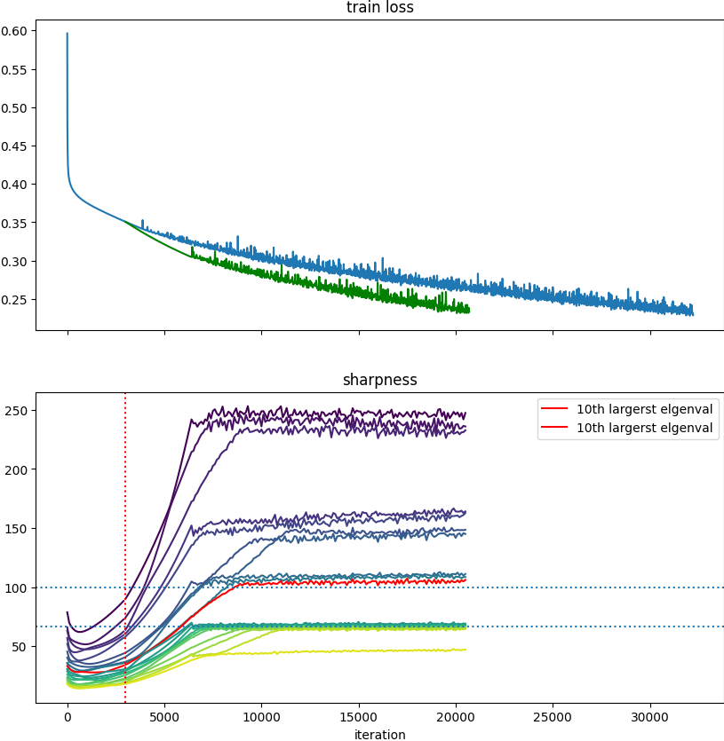
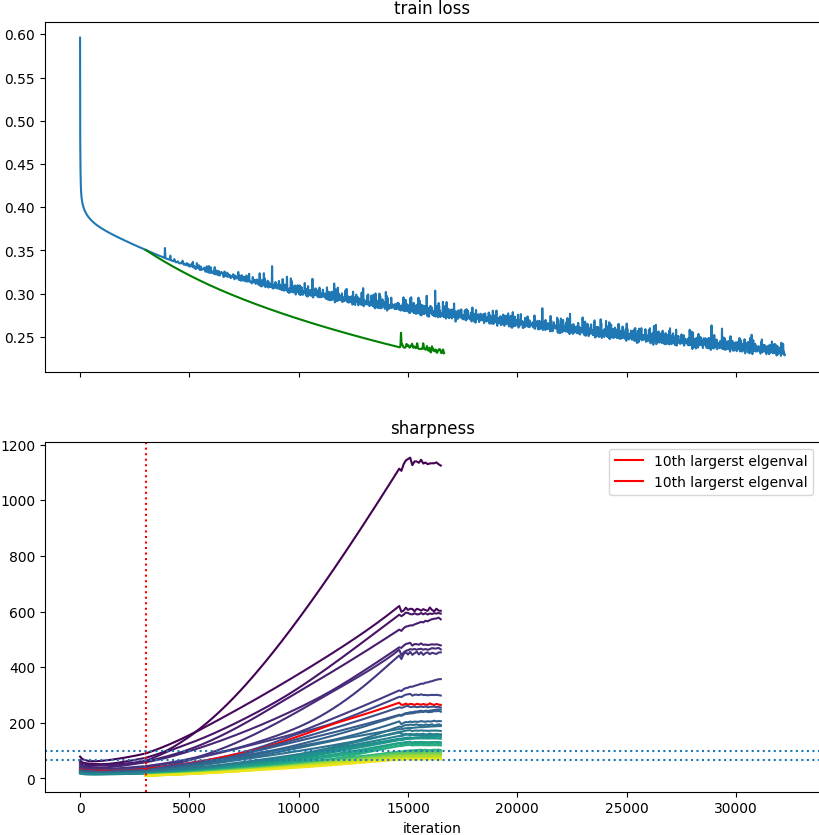

# Spectral_Acceleration

## 用法
主要运行程序为 `gd.py` ,类比于cohen的库主要新增的arguments有 `--mode, --scaling, --nfilter`。使用案例如下：

首先设置：
1. Set the `DATASETS` environment variable to a directory where datasets will be stored.
 For example: `export DATASET="/my/directory/datasets"`.
2. Set the `RESULTS` environment variable to a directory where results will be stored.
 For example: `export RESULTS="/my/directory/results"`.
 
 然后使用如下指令运行：

```
python src/gd.py cifar10-20k fc-tanh  mse  0.01 100000 --acc_goal 0.99 --neigs 20  --eig_freq 100 --mode global_scaling --scaling 1.0 --nfilter 20
``` 
以上的指令会在cifar10-20k的数据中训练一个cnn-relu模型，具体模型细节见`arch.py`， 使用mse损失，步长为0.01，并最多训练100000步（由于是GD，相对于最多100000个epoch），并且100000步内在训练acc达到0.99的时候停止，在此之间每100步计算并保存一次二阶信息，包含前20大的特征值及其特征向量。

`mode`决定了我们以什么样的方式进行加速，其选择有三种： `global_scaing, flat_scaling_v1, flat_scaling_v2`。为了简便，当且仅当我们选择`mode == global_scaling` 且`scaling == 1.0`的时候，我们会在当前的setting下从头开始训练一个神经网络并在第3000步（在`gd.py`的144行可更改）的时候保存一个**中间神经网络**。然后在接下来只要我们选择其他的mode或者其他的scaling的时候，我们就会从这个**中间神经网络**处开始训练，以达到对比的目的。

比如，我在运行了上述指令后，再运行一个：
```
python src/gd.py cifar10-20k fc-tanh  mse  0.01 100000 --acc_goal 0.99 --neigs 20  --eig_freq 100 --mode global_scaling --scaling 1.5 --nfilter 20
``` 
我就会得到**中间神经网络**开始，步长变为原本的1.5倍的训练结果，因为是global_scaling，我只会简单的将步长乘1.5倍

如果又运行了：
```
python src/gd.py cifar10-20k fc-tanh  mse  0.01 100000 --acc_goal 0.99 --neigs 20  --eig_freq 100 --mode flat_scaling_v1 --scaling 1.5 --nfilter 20
``` 
此时我会从**中间神经网络**开始，做一个加速，这种加速会将最大的`nfilter`个特征值的特征方向**停止**， 仅更新其他的特征方向，并且在其他的特征方向上步长乘1.5倍。此为flat_scaling_v1 的效果，如果选择flat_scaling_v2， 就会使最大的`nfilter`个特征值的特征方向**保持1倍步长**，其他的特征方向上步长乘1.5倍。

在Spectral的角度下看梯度下降，把Hessian和Gradient都在谱空间（Hesssian特征向量）上分解。

**Intuition**: 首先，基于GD更新的loss的Quadratic Taylor Approximation如下：

$$
L(\theta_{t+1}) - L(\theta_t) \approx \eta \nabla L(\theta_t)(\theta_{t+1}-\theta_t) + \frac{1}{2}  (\theta_{t+1}-\theta_t)^T \nabla^2L(\theta_t) (\theta_{t+1}-\theta_t)
$$
$$
=-\eta  ||\nabla L(\theta_t)||_2^2 + \frac{\eta^2}{2} \nabla L(\theta_t)^T \nabla^2L(\theta_t) \nabla L(\theta_t)
$$
在这里我们以Spectral的视角看待这个过程，首先对于Hessian矩阵做谱分解：$\nabla^2L(\theta) = \sum_{i=0}^n \lambda_i(\theta) u_i(\theta) u_i(\theta)^T$， 然后我们对每一次的梯度以这一步的Hessian的特征向量为基做分解：$\nabla L(\theta) = \sum_{i=0}^{n}c_i (\theta)u_i(\theta)$， 其中$c_i(\theta)$是标量，表达的是当前梯度中的第$i$个特征向量的占比。把这两个谱分解带入上式，则有：
$$
L(\theta_{t+1}) - L(\theta_t) \approx -\eta \sum_{i=0}^{n} c_i(\theta_t)^2 + \frac{\eta^2}{2}\sum_{i=0}^{n} c_i(\theta_t)^2 \lambda_i(\theta_t)
$$
$$
= \sum_{i=0}^{n}c_i(\theta_t)^2\textcolor{red}{(\frac{\eta^2}{2}\lambda_i(\theta_t) - \eta)}
$$
从上面的分析看出，任何一个大于$2/\eta$的特征值的特征方向的更新都不能对Loss下降带来任何好处，这是基于EOS的谱视角所带来的观察。

这个加速的做法就是：
$$
\theta_{t+1} = \theta_{t} - \eta \textcolor{blue}{\alpha} \textcolor{blue}{P} \nabla L(\theta)
$$
Where alpha is a scaler and:
$$
\textcolor{blue}{P}  = I - \sum_{i=0}^{topN} u_i u_i ^{T}
$$
这一方法是把特征值高（topN大的特征值）的特征方向的更新**停止（停止Bouncing的行为）**，并把特征值低的方向通过一个scaler $\alpha$ 加速。这是一个即插即用的方法，因为在所有的基于梯度的方法中都可以在梯度向量前乘上这个矩阵。

当我逐一运行了以上代码，就可以直接再运行`demo.py`就能直接的比较三种加速相比于原本的情况的loss curve了，如果实验设置有变化可以通过修改`demo.py`来展示.

下面的图表示了在cifar10-20k数据集上训练的fc-tanh模型，使用mse loss并且步长为0.05，蓝色表示original run，红色表示在3000步时使用 global_scaling 将步长扩大两倍，黄色代表高频步长1.0倍，仅低频步长扩大2.0倍，绿色代表高频不更新，低频步长扩大2.0倍。

这里我们看到各种加速都还是有锯齿即catapults出现，这应该是因为我们并不是每一步都计算eigenvectors并使用这种准确的eigenvectors来过滤，而是每100步算一次eigenvector并构建相应的过滤矩阵，每100步才更新一下这个过滤矩阵。还有就是Minhak的新论文没用对优化器做任何改变，我们在加速过后肯定会涉及到eigenvalue和eigenvector的变化，这是可以进一步观察的点。



注意到3000步（蓝色虚线处）增大步长之后和有很大的spike（如果步长增大倍数为3甚至更大的时候，是肯定会发散的），特别是红色（即朴素的增大步长），zoom in之后(下图)，发现确实如此，绿色和黄色这种屏蔽了特征值高的方向的更新会减弱这种spike的出现。说明这个spike一定是高特征值方向的更新带来的。




下图表示了使用fc-tanh网络训练整个cifar10数据集的表现，在lr=0.02的情况下：



非常欣慰的是这个加速的结果始终是 绿色>黄色>红色

## 主要函数

主要实现加速的类是`gd.py`中的`class AcD`， 简单重写了一个Optimizer类来使用。

## Sharpness Dynamics 的研究

这里展示一下这几种scaling方法对模型Sharpness的影响，在这里我们会指出，在这个方面，flat_scaling_v1 flat_scaling_v2 的差别非常之大。注意，以下的实验都是先在不做任何操作的实验上跑3000步，再将优化策略换成上述三类来进行比较。

首先，我们查看fc-tanh在Cifar10全部数据上训练的结果，此处我们不做任何操作，让模型训练到train_acc到0.8的时候结束：



其中上面的图代表train loss，下面的代表前20大的eigenvalue值相对于iteration的演化。这一演示比较常见，接下来我们分别画出在3000步的时候换成三种不同的优化策略后的train loss情况（绿色）以及eigenvalue情况：

首先下面第一个是global scaling 1.5倍，即直接将步长增大1.5倍：这一效果比较常见，会产生比较大的Catapults，并且这个过程可以看作是一个One-step Warmup，所以说对于原先的加速了一点也正常。


接下来第二个是flat scaling v2 1.5倍，v2所使用的策略是将top20个eigenvalue的方向保持原步长更新，而剩余的其他方向的更新步长增大1.5倍：可以看到这个方法的好处非常明显，首先由于在高频步长保持原本大小使得不会出现很大的Catapults，即Spike不会出现，而且看变化过后的eigenvalue dynamics和不做改变的run 基本没什么区别。看起来像是把original的图**压缩**了一下。细小的Catapults一样会出现，这是一种**无痛加速**的方法


最后是flat scaling v1 1.5倍，v1所使用的策略是将top20的eigenvalue的方向停止更新，（他们的步长直接设为0），只更新剩余方向，并加速1.5倍：这个方法在eigenvalue视角下和其他方法有很大的不同。根据下图，这个方法能延长Progressive Sharpenning（PS）阶段，或者直接让模型从EoS阶段回到PS阶段，loss会在改变的一段时间内重新平滑的单调下降，这意味着，**这个方法把MSS提高了不少，并且在更快降低loss的同时也很快的在增大Sharpness及其他eigenvalue**。


捋一遍原因：因为高频（Dom）的作用如果只是贡献了振荡的话，完全可以在上面不更新，导致了很奇怪的事情发生:

+ 最大的一些特征值仍然在上升，可能被认为是特征值上升和loss平滑下降是必须同时发生的。
+ 什么时候loss重新开始抖动： 模型在后期也会重新进入EoS，这肯定代表着有其他的会更新的方向的特征方向的特征值达到了MSS，这代表了这个方法使得更多的特征值变得更大。这从根本上

以上都是跑的nfilter是20的，下面我也跑了nfilter是10或者40的情况。加速难道是nfilter越大越好？道理上肯定不是，因为：
+ 如果nfilter很大，在一些没有饱和的方向就得不到加速或者放弃更新了，这肯定是相当于减速的。
+ 如果要最精确的控制nfilter的话，这肯定是动态的，即大于MSS的eigendirection就可以被停止了，这是一个动态的投影矩阵。
+ 更深度的问题在于，在mask掉的eigendirection上，在接下来的更新中他们的eigenvalue还会上升，这说明了eigenvalue的增大（Progressive Sharpening）和梯度在之对应的eigenvector上的更新没有什么关系。是和loss的快速下降有关系？现在是如下关系：
    + 在eigenvalue大于MSS的方向，如果进行更新，就会出现Catapults，相应的会有loss spike，可能会有EOS的经典现象比如Oscillation存在，而且一直更新的话eigenvalue会维持在MSS值附近。
    + 在eigenvalue大于MSS的方向，如果不进行更新，那么在这个方向的eigenvalue居然会一直增大，因为catapults不会发生，因此并不会出现Self-stabilization来使得eigenvalue降低，这个增大会持续到其他在更新的eigendirection的eigenvalue大于MSS之后，模型重新会进入EOS。(比如设置nfilter为20的话，前20大的eigenvalue会一直单调增大，直到第21大的eigenvalue大于MSS)

综上所述，我们应该使用动态的投影矩阵，而且我认为**我们可以做一个warmup**， 也就是说我们在增大步长，而且是每当某一个方向的eigenvalue撞到warmup MSS的时候就把这个方向给停了。**这是一个很新的想法，同时兼顾了投影矩阵的策略以及步长scaler的选取**。

问题是：**当选取任意一种训练策略的时候，真的是当这个方向的eigenvalue到MSS之后就学不到东西（下降不了loss）了吗？增大或者减小步长呢**？ 对饱和方向来说，减小步长和步长直接设为0有什么区别吗？







在研究了nfilter的个数带来的问题之后，还有一个重要问题是scaler大小的选取，在此我们先使用比较理想的warmup方式来看看效果如何


## Leading eigendirection发生在哪

如果我们要真正使用这种加速方式，就一定要能够实现快速的求出前几个eigenvalue的方向，才能更快的求出flat_matrix。

首先我们得知道梯度分解为特征方向后每个方向的含量为多少

## Todo
momentum参数0.99就更好了？ **解答：似乎beta越大在整个训练过程中速度会减慢，PS的速度变慢，而且有可能PS速度和loss下降速度成正比。**

我现在可以比较的是：
Momentum比较：不同beta对速度的影响，对PS速度的影响 [get]
待做实验：warmup momentum是否一样的继承loss速度和PS速度？[get] warmup之后确实能够维持当前的PS过去，但是目前对收敛速度时间并没有改变

gradient norm是否平滑 [get] 单调下降的时候gn都很小，EOS的时候GN比较大，可能就算是GN大但是对loss下降没有什么帮助

同时也画出了Filter之后的梯度模[get]filter之后都是趋于0的。


为什么GDM能近似一个Bulk-GD
能不能给出一个intuition来找hessian或者这个方法的candidate

momentum beta变大（接近1）（优化：beta warmup）和bulk-GD是不是一个效果？
[get]这需要在cnn上验证一遍。

warmup beta 的动量法和原版有差不多的loss下降能力，不会因为后者进入EOS而被甩开太久
[get]后续并不知道，在cnn上继续验证

但是momentum不能加速低频。[不能忍受的是momentum通过warmup beta能够得到和Bulk-GD一直一样的效果，在相同的effective lr下]

momentum并没有filter的过程，但是为什么能够。

SGD ， resnet 迁移
--迁移结束就汇报

分层算hessian，在拼起来

除去在代码上优化此过程，还可以挖掘更多的信息

我们的研究现在是抛开了Initialization，这我们觉得是更深度的内容，不包含在这次。可以参考Karla

快速下降loss的最直接的关系：大lr+不进入EoS（保证所有eigenvalue大于MSS的方向不更新）

都训练到相同的acc比时间好像没用了，因为对于SGD很难收到0.99

接下来晚上比较相同epochs都到达了什么样的acc   先从500个epoch开始吧。

SGD很多都达不到EOS，然后就想着还是加速，中间存一个中途的然后使用三种加速方式来对比