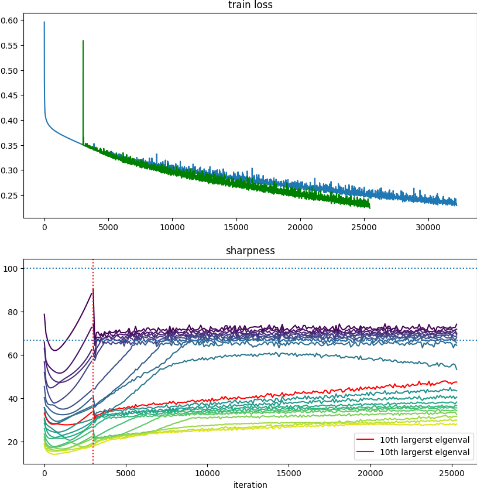
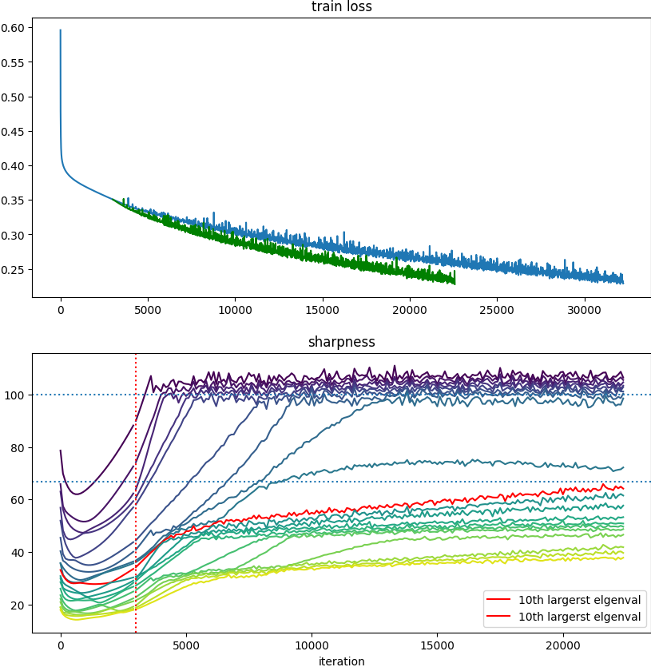
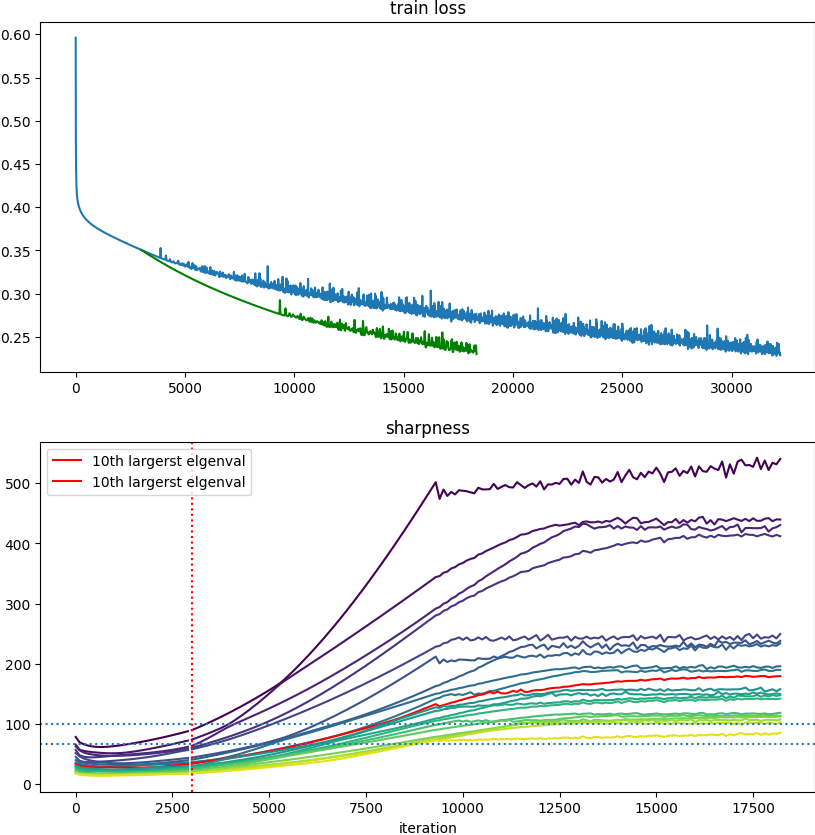

# Spectral_Acceleration

## 用法
主要运行程序为 `gd.py` ,类比于cohen的库主要新增的arguments有 `--mode, --scaling, --nfilter`。使用案例如下：

首先设置：
1. Set the `DATASETS` environment variable to a directory where datasets will be stored.
 For example: `export DATASET="/my/directory/datasets"`.
2. Set the `RESULTS` environment variable to a directory where results will be stored.
 For example: `export RESULTS="/my/directory/results"`.
 
 然后使用如下指令运行：

```
python src/gd.py cifar10-20k fc-tanh  mse  0.01 100000 --acc_goal 0.99 --neigs 20  --eig_freq 100 --mode global_scaling --scaling 1.0 --nfilter 20
``` 
以上的指令会在cifar10-20k的数据中训练一个cnn-relu模型，具体模型细节见`arch.py`， 使用mse损失，步长为0.01，并最多训练100000步（由于是GD，相对于最多100000个epoch），并且100000步内在训练acc达到0.99的时候停止，在此之间每100步计算并保存一次二阶信息，包含前20大的特征值及其特征向量。

`mode`决定了我们以什么样的方式进行加速，其选择有三种： `global_scaing, flat_scaling_v1, flat_scaling_v2`。为了简便，当且仅当我们选择`mode == global_scaling` 且`scaling == 1.0`的时候，我们会在当前的setting下从头开始训练一个神经网络并在第3000步（在`gd.py`的144行可更改）的时候保存一个**中间神经网络**。然后在接下来只要我们选择其他的mode或者其他的scaling的时候，我们就会从这个**中间神经网络**处开始训练，以达到对比的目的。

比如，我在运行了上述指令后，再运行一个：
```
python src/gd.py cifar10-20k fc-tanh  mse  0.01 100000 --acc_goal 0.99 --neigs 20  --eig_freq 100 --mode global_scaling --scaling 1.5 --nfilter 20
``` 
我就会得到**中间神经网络**开始，步长变为原本的1.5倍的训练结果，因为是global_scaling，我只会简单的将步长乘1.5倍

如果我又运行了：
```
python src/gd.py cifar10-20k fc-tanh  mse  0.01 100000 --acc_goal 0.99 --neigs 20  --eig_freq 100 --mode flat_scaling_v1 --scaling 1.5 --nfilter 20
``` 
此时我会从**中间神经网络**开始，做一个加速，这种加速会将最大的`nfilter`个特征值的特征方向**停止**， 仅更新其他的特征方向，并且在其他的特征方向上步长乘1.5倍。此为flat_scaling_v1 的效果，如果选择flat_scaling_v2， 就会使最大的`nfilter`个特征值的特征方向**保持1倍步长**，其他的特征方向上步长乘1.5倍。

当我逐一运行了以上代码，就可以直接再运行`demo.py`就能直接的比较三种加速相比于原本的情况的loss curve了，如果实验设置有变化可以通过修改`demo.py`来展示.

下面的图表示了在cifar10-20k数据集上训练的fc-tanh模型，使用mse loss并且步长为0.05，蓝色表示original run，红色表示在3000步时使用 global_scaling 将步长扩大两倍，黄色代表高频步长1.0倍，仅低频步长扩大2.0倍，绿色代表高频不更新，低频步长扩大2.0倍。

这里我们看到各种加速都还是有锯齿即catapults出现，这应该是因为我们并不是每一步都计算eigenvectors并使用这种准确的eigenvectors来过滤，而是每100步算一次eigenvector并构建相应的过滤矩阵，每100步才更新一下这个过滤矩阵。还有就是Minhak的新论文没用对优化器做任何改变，我们在加速过后肯定会涉及到eigenvalue和eigenvector的变化，这是可以进一步观察的点。


注意到3000步（蓝色虚线处）增大步长之后和有很大的spike（如果步长增大倍数为3甚至更大的时候，是肯定会发散的），特别是红色（即朴素的增大步长），zoom in之后(下图)，发现确实如此，绿色和黄色这种屏蔽了特征值高的方向的更新会减弱这种spike的出现。


下图表示了使用fc-tanh网络训练整个cifar10数据集的表现，在lr=0.02的情况下：


非常欣慰的是这个加速的结果始终是 绿色>黄色>红色

## 主要函数

主要实现加速的类是`gd.py`中的`class AcD`， 简单重写了一个Optimizer类来使用。

## Sharpness Dynamics 的研究

这里展示一下这几种scaling方法对模型Sharpness的影响，在这里我们会指出，在这个方面，flat_scaling_v1 flat_scaling_v2 的差别非常之大。注意，以下的实验都是先在不做任何操作的实验上跑3000步，再将优化策略换成上述三类来进行比较。

首先，我们查看fc-tanh在Cifar10全部数据上训练的结果，此处我们不做任何操作，让模型训练到train_acc到0.8的时候结束：


其中上面的图代表train loss，下面的代表前20大的eigenvalue值相对于iteration的演化。这一演示比较常见，接下来我们分别画出在3000步的时候换成三种不同的优化策略后的train loss情况（绿色）以及eigenvalue情况：

首先下面第一个是global scaling 1.5倍，即直接将步长增大1.5倍：这一效果比较常见，会产生比较大的Catapults，并且这个过程可以看作是一个One-step Warmup，所以说对于原先的加速了一点也正常。


接下来第二个是flat scaling v2 1.5倍，v2所使用的策略是将top20个eigenvalue的方向保持原步长更新，而剩余的其他方向的更新步长增大1.5倍：可以看到这个方法的好处非常明显，首先由于在高频步长保持原本大小使得不会出现很大的Catapults，即Spike不会出现，而且看变化过后的eigenvalue dynamics和不做改变的run 基本没什么区别。细小的Catapults一样会出现，这是一种**无痛加速**的方法


最后是flat scaling v1 1.5倍，v1所使用的策略是将top20的eigenvalue的方向停止更新，（他们的步长直接设为0），只更新剩余方向，并加速1.5倍：这个方法在eigenvalue视角下和其他方法有很大的不同。根据下图，这个方法能延长Progressive Sharpenning（PS）阶段，或者直接让模型从EoS阶段回到PS阶段，loss会在改变的一段时间内重新平滑的单调下降，这意味着，**这个方法把MSS提高了不少，并且在更快降低loss的同时也很快的在增大Sharpness及其他eigenvalue**。


## Leading eigendirection发生在哪

如果我们要真正使用这种加速方式，就一定要能够实现快速的求出前几个eigenvalue的方向，才能更快的求出flat_matrix。